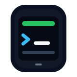

<p align="center">
  
</p>

<h1 align="center">tmuxes</h1>

<p align="center">
  <strong>We are building the best terminal experience mobile can offer.</strong>
</p>

<p align="center">
  The terminal-first Android app for durable SSH/tmux workspaces,
  programmable launcher widgets, SSH forwarding, and CLI-native development.
</p>

<p align="center">
  <a href="https://github.com/Lightcone-ZhangYifa/tmuxes/actions/workflows/android-ci.yml"></a>
  <a href="https://github.com/Lightcone-ZhangYifa/tmuxes/actions/workflows/codeql.yml"></a>
  <a href="https://github.com/Lightcone-ZhangYifa/tmuxes/releases/latest"></a>
  <a href="LICENSE"></a>
  <a href="app/build.gradle.kts"></a>
  <a href="build.gradle.kts"></a>
</p>

<p align="center">
  <a href="https://github.com/Lightcone-ZhangYifa/tmuxes/releases/latest"><strong>Download</strong></a>
  ·
  <a href="#quick-start"><strong>Quick Start</strong></a>
  ·
  <a href="#why-it-feels-different"><strong>Why Different</strong></a>
  ·
  <a href="#semi-transparent-widgets"><strong>Widgets</strong></a>
  ·
  <a href="docs/README.md"><strong>Docs</strong></a>
  ·
  <a href="CONTRIBUTING.md"><strong>Contribute</strong></a>
</p>

<p align="center">
  
  <br>
  <sub>Real Claude Code and Codex widgets, full-screen htop, working SSH forwarding, and parent-child server topology.</sub>
</p>

<table>
  <tr>
    <td width="25%">
      <strong>tmux-first continuity</strong><br>
      Attach from phone, tablet, or desktop to the same tmux session without
      losing context.
    </td>
    <td width="25%">
      <strong>Programmable widgets</strong><br>
      Put terminal output, watch commands, dashboards, and custom scripts on
      the launcher.
    </td>
    <td width="25%">
      <strong>Private topology built in</strong><br>
      Model bastions, child servers, SSH forwarding, and private service ports
      inside the same trusted workspace.
    </td>
    <td width="25%">
      <strong>CLI-native development</strong><br>
      Use the terminal tools developers already know, including Codex CLI and
      Claude Code, without a reduced mobile shell.
    </td>
  </tr>
</table>

Most mobile terminal apps are still emergency SSH clients: open a connection,
run a command, hope the phone stays awake. tmuxes is designed for a different
standard. It treats your phone as a durable control panel for remote machines:
sessions live on the server, CLI tools keep their full power, important
terminal state can stay visible from the home screen, private services can be
reached through SSH tunnels, and real server topologies can be modeled instead
of flattened into a fragile list.

Our focus is the terminal first: the shell, the remote machine, the tools, and
the long-running work developers already trust. Because modern coding agents
also belong in that environment, tmuxes naturally becomes a powerful portable
vibe-coding tool too.

If you have ever wanted to check a build, inspect logs, restart a service, run
Codex CLI or Claude Code, peek at a dashboard, or keep a remote shell alive
while away from your desk, this is the kind of mobile terminal we want to make
delightful.

tmuxes is independent software and is not affiliated with tmux.

## Why It Feels Different

### tmux Owns Continuity

In tmuxes, tmux is not a checkbox integration. It is the session model.

Your shells, editors, logs, monitors, and build jobs live in tmux on the remote
machine. The Android app attaches to that durable workspace instead of becoming
the owner of the work. App restarts, network changes, phone sleep, and normal
mobile multitasking should not destroy the thing you were doing. The same tmux
session can stay attached from desktop and mobile at once, so switching devices
feels like continuing the same work rather than starting a new terminal.

### Widgets Make Terminals Ambient

On mobile, opening the app is often the slow path. tmuxes can expose live
terminal snapshots through Android launcher widgets, so a build, log stream,
monitor, queue, or long-running shell can stay visible before you even open
the app.

The programmable surface is the terminal output itself. A script, watch
command, TUI, coding agent status line, or project-specific CLI can become a
launcher widget because tmuxes renders the session rather than forcing you into
a fixed set of cards.

### SSH Forwarding Makes It A Workspace

Remote development is rarely just a shell. Developers need preview servers,
admin panels, metrics pages, databases, internal dashboards, and service ports
that should not be public.

tmuxes includes local and remote SSH forwarding so the terminal, the session
model, and private network access share the same server and host-key trust
boundary.

### Parent Servers Model Real Networks

Many useful machines are not reachable directly from a phone. They sit behind
bastions, jump hosts, lab networks, VPN edges, or private subnets.

tmuxes lets servers form parent-child trees. A parent server acts as a native
ProxyJump-style tunnel using SSH direct-tcpip channels; every child still owns
its own SSH client, host-key verification, keepalive, forwarding rules, tmux
sessions, and credentials. That keeps the mental model close to OpenSSH while
making the topology visible in the app.

The server list stays structured instead of becoming a flat pile of hosts:
children are indented, parent failures propagate clearly, child backoff resets
when a parent recovers, and servers can be added as children, imported from
SSH config, or rearranged by drag-and-drop reparenting.

### Portable Coding Stays Terminal-Native

tmuxes is first a mobile terminal, but that is exactly why it can also become
one of the best portable vibe-coding surfaces. The best coding agents already
feel native to developers because they live in the terminal, alongside the
same shells, repos, editors, tests, logs, and scripts that real work depends on.

Run Codex CLI, Claude Code, editors, test runners, build tools, deploy scripts,
and project-specific commands inside the same SSH/tmux workspace you already
use on desktop. tmuxes carries that workflow to mobile without shrinking it
into a separate app or a chat-only window, and without asking you to trade away
shell access, repo context, keyboard-driven workflows, terminal output, or
long-running processes just because you are on a phone.

That same CLI-native model makes widgets unusually flexible. A tmuxes widget
can show whatever your terminal can produce: a CI dashboard, a server monitor,
a queue, a watch command, a custom script, an agent status view, or your own
project-specific TUI. If you can build it for a CLI, you can shape it into a
phone home-screen surface without waiting for a dedicated widget SDK. YAML can
bind the widget to a session and persist appearance; the programmability comes
from the running CLI process.

### Android Input Remains Native

Terminals are unforgiving input surfaces. A mobile terminal cannot feel serious
if it breaks IME composition, paste, function keys, voice dictation, or the
copy workflow developers rely on.

tmuxes treats Android input as a first-class terminal path. Native IME function
keys such as arrows, Home, End, Tab, Delete, and Enter are routed into the same
terminal key pipeline as hardware keys and the extra keybar. Composition-based
input, including Chinese, Japanese, and Android voice dictation, commits as
normal terminal text instead of being trapped in a fake edit field. IME paste,
context-menu paste, long-press paste, selection copy, phone clipboard, remote
clipboard, modifiers, Fn pages, and bracketed paste are adapted deliberately so
the terminal can keep Android-native input behavior without sacrificing shell
correctness.

## Feature Tour

<table>
  <tr>
    <td width="25%">
      
    </td>
    <td width="25%">
      
    </td>
    <td width="25%">
      
    </td>
    <td width="25%">
      
    </td>
  </tr>
  <tr>
    <td>
      <strong>Agents stay visible</strong><br>
      Claude Code and Codex run as real CLI tools in tmux, then stay visible as
      live launcher widgets without becoming separate chat-only mobile apps.
    </td>
    <td>
      <strong>Monitors become ambient</strong><br>
      A full-screen htop widget is just a real tmux session rendered on Android,
      so resource monitors, TUIs, and dashboards can live outside the app.
    </td>
    <td>
      <strong>Forwarding shows results</strong><br>
      A private preview served on the remote host opens from the phone through
      a local SSH forward.
    </td>
    <td>
      <strong>Private networks stay structured</strong><br>
      Parent-child servers model ProxyJump topologies without flattening
      bastions, internal hosts, and nested machines into one long list.
    </td>
  </tr>
</table>

## Semi-Transparent Widgets

tmuxes widgets are not another configuration dashboard. They are live terminal
surfaces that belong on the Android launcher: one can fill a whole home screen,
sit beside everyday app icons, stack with another session, or form a dense board
of mixed-size status panels.

<p align="center">
  
  <br>
  <sub>Full-screen command center, app-icon coexistence, stacked sessions, and dense mixed-size dashboard layouts.</sub>
</p>

<table>
  <tr>
    <td width="25%">
      <strong>Beautiful at a glance</strong><br>
      Semi-transparent widgets sit on the launcher like native Android
      surfaces, so important terminal state can stay visible without turning
      the home screen into a wall of app chrome.
    </td>
    <td width="25%">
      <strong>Sessions feel Android-native</strong><br>
      Put multiple tmux sessions directly on the launcher instead of hiding
      them behind a long row of terminal tabs. The home screen becomes a
      session board.
    </td>
    <td width="25%">
      <strong>Programmable by CLI</strong><br>
      If you can print it, watch it, or build it as a TUI, you can make it a
      widget. YAML binds the session and appearance; the freedom comes from
      the running CLI process.
    </td>
    <td width="25%">
      <strong>Always-on monitoring</strong><br>
      Keep build status, agent progress, SSH forwarding health, logs, queues,
      and server metrics visible in real time without opening the app first.
    </td>
  </tr>
</table>

## The Shape Of The App

| Typical mobile terminal | tmuxes |
| --- | --- |
| SSH sessions feel tied to one app instance | Attach phone, tablet, and desktop clients to the same tmux session. |
| Coding agents are separate mobile apps or chat boxes | Codex CLI, Claude Code, and other CLI tools run in your own terminal. |
| You open the app just to check state | Widgets keep important sessions visible. |
| Bastions and internal hosts are flattened into one list | Parent-child servers model ProxyJump topologies directly. |
| Port forwarding is separate or missing | Local and remote forwarding are part of the SSH workflow. |
| Remote work disappears into one terminal tab | Servers, sessions, widgets, snippets, and settings are structured. |
| Mobile keyboard behavior breaks terminal expectations | IME, voice input, function keys, modifiers, copy, and paste are terminal-aware. |
| Widgets expose only predefined cards | Any CLI output can become a widget surface. |

## What You Can Do Today

| Work from the phone | Keep the terminal real |
| --- | --- |
| Add SSH servers, authenticate with passwords or private keys, persist known-host records, and organize hosts into parent-child ProxyJump trees. | Attach to tmux-backed sessions from mobile or desktop, keep long-running work alive, and move between devices without losing state. |
| Put terminal snapshots on the launcher with configurable widgets. | Run terminal-native coding tools such as Codex CLI and Claude Code in the same remote workspace you use from a desktop. |
| Use a Quick Settings tile for fast connection control. | Create local and remote SSH forwards for private services and development ports, including hosts reached through parent servers. |
| Customize terminal input, appearance, snippets, widgets, and YAML-backed configuration from inside the app. | Inspect and edit structured app configuration without hiding important state behind opaque UI. |

## Quick Start

The easiest way to try tmuxes is to install the latest signed APK from
[GitHub Releases](https://github.com/Lightcone-ZhangYifa/tmuxes/releases/latest).

<p>
  <a href="https://github.com/Lightcone-ZhangYifa/tmuxes/releases/latest"></a>
  <a href="docs/README.md"></a>
</p>

To build from source:

Requirements:

- JDK 17
- Android SDK with API 36
- Android platform-tools on `PATH`

Build and validate the debug app:

```bash
./gradlew compileDebugKotlin testDebugUnitTest checkDesignRules lintDebug
./gradlew assembleDebug
```

Install it on a connected device or emulator:

```bash
adb install -r -t app/build/outputs/apk/debug/app-debug.apk
adb shell am start -n com.tmuxes.debug/com.tmuxes.MainActivity
```

Release signing material is intentionally private. Unsigned release builds work
from source; signed releases use local or CI-injected properties described in
[docs/RELEASING.md](docs/RELEASING.md).

## Project Status

tmuxes is usable today as an Android SSH/tmux terminal and is still growing
toward a broader mobile terminal platform.

The current adaptation and test baseline is Linux hosts where tmux starts
Bash. We especially welcome contributors who want to broaden that foundation:
other Linux shells, Windows work through psmux, stronger onboarding, richer
widgets, and an eventual iOS implementation are all meaningful directions.

## Contributing

Welcome. If you care about terminal UX, remote development, self-hosting,
mobile computing, SSH, tmux, Android, or developer tools, there is useful work
to do here.

You do not need to understand the whole app to help. Good contributions are
focused, reproducible, and easy to review: explain the problem, keep the
change scoped, preserve external behavior unless the PR says otherwise, add
tests where risk justifies them, and run the quality gate before opening the
pull request.

High-impact contribution areas:

- **First-run onboarding**: tmuxes does not yet have a guided setup flow. A
  great onboarding experience should help new users add a server, understand
  the tmux-first model, open their first session, and place a useful widget
  without exposing private host data.
- **Linux shell coverage**: the current adaptation and tests focus on tmux
  starting Bash. Contributions for zsh, fish, dash, tcsh, and other Linux
  shells should account for startup files, prompts, quoting, command
  invocation, and terminal capability differences.
- **Windows through psmux**: contributors can help validate
  [psmux](https://github.com/psmux/psmux) as the Windows-side
  tmux-compatible layer, then adapt tmuxes for shells hosted there,
  especially PowerShell and cmd.exe.
- **iOS platform work**: tmuxes is Android-only today. Contributors interested
  in bringing the same tmux-first terminal, widget, and forwarding ideas to
  iOS are welcome to explore a native iOS implementation that shares the
  project principles.

Read [CONTRIBUTING.md](CONTRIBUTING.md) before starting non-trivial work.
Never commit private keys, passwords, hostnames, production logs, generated
APKs, app bundles, keystores, or release-signing material.

## Architecture And Quality

| Area | What it owns |
| --- | --- |
| `ssh` | SSH configuration, host-key verification, connection pool, forwarding, keepalive |
| `tmux` | tmux command construction, session creation, attach, rename, kill, picker flows |
| `terminal` | Emulator state, renderer, gestures, input, copy/paste, modifier handling |
| `widget` | Launcher widgets, bitmap terminal previews, Quick Settings integration |
| `data` | Room, DataStore, YAML repositories, settings registry, app models |
| `editor` | YAML editor commands, diagnostics, completion, keybar, editing bubbles |
| `ui` | Compose screens, app components, navigation, design tokens |

The main local gate is:

```bash
./gradlew compileDebugKotlin testDebugUnitTest checkDesignRules lintDebug
```

`checkDesignRules` enforces project-specific contracts for UI tokens, i18n,
logging, settings access, coroutine boundaries, package layering, import
hygiene, and storage paths. CI runs compilation, JVM tests, design-rule gates,
lint, CodeQL analysis, and dependency automation.

Start with [docs/README.md](docs/README.md) for the documentation map and
[docs/ARCHITECTURE.md](docs/ARCHITECTURE.md) for package boundaries.

## Security And Privacy

tmuxes manages SSH credentials, host fingerprints, configuration, and debug
logs. Report sensitive vulnerabilities through the private process in
[SECURITY.md](SECURITY.md), and review [docs/PRIVACY.md](docs/PRIVACY.md) for
the current data-handling model.

## Third-Party Software

See [THIRD_PARTY_NOTICES.md](THIRD_PARTY_NOTICES.md) for the primary runtime
libraries, bundled assets, and license notes.

## License

tmuxes is licensed under the [GNU General Public License v3.0 only](LICENSE)
(`GPL-3.0-only`), except for bundled third-party assets and libraries that
retain their own licenses.
