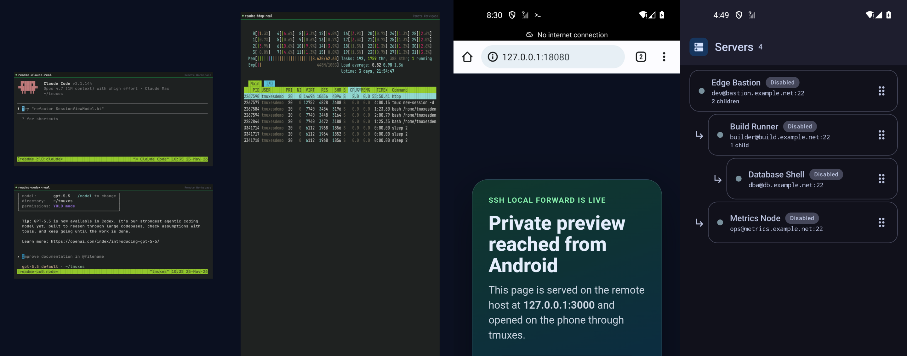
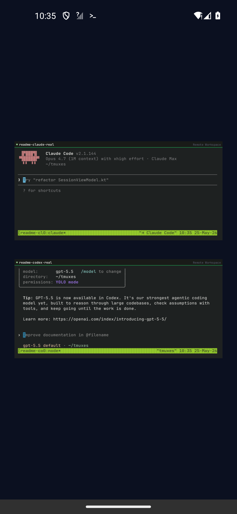
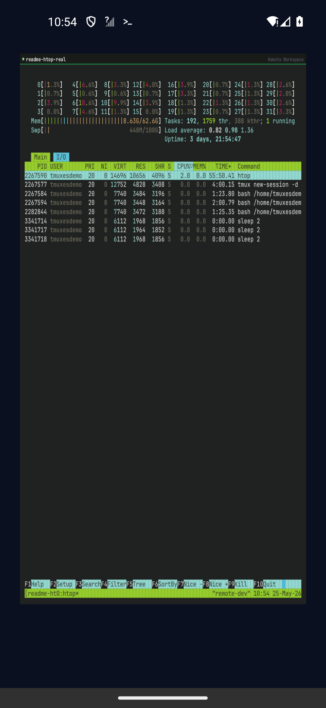
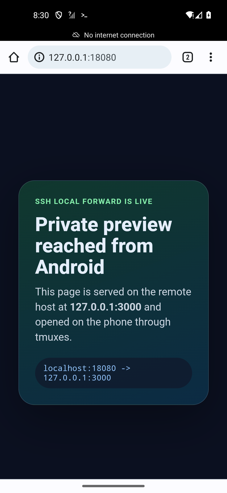
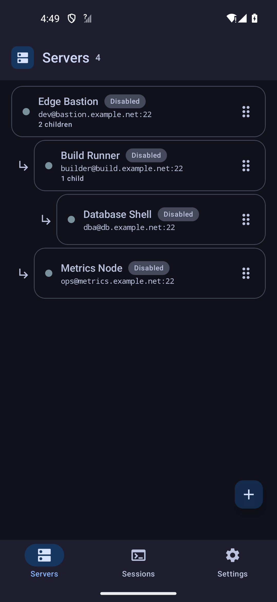
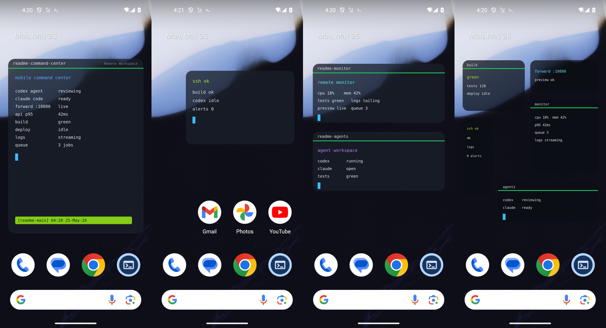

<p align="center">
  
</p>

<h1 align="center">tmuxes</h1>

<p align="center">
  <a href="README.md">English</a>
  ·
  <strong>简体中文</strong>
</p>

<p align="center">
  <strong>我们致力于做移动端最好用的终端应用。</strong>
</p>

<p align="center">
  一个以 SSH/tmux 为核心的 Android 终端：持久远程工作区、可编程桌面磁贴、
  SSH Forwarding、父子服务器，以及真正命令行原生的开发体验。
</p>

<p align="center">
  <a href="https://github.com/Lightcone-ZhangYifa/tmuxes/actions/workflows/android-ci.yml"></a>
  <a href="https://github.com/Lightcone-ZhangYifa/tmuxes/actions/workflows/codeql.yml"></a>
  <a href="https://github.com/Lightcone-ZhangYifa/tmuxes/releases/latest"></a>
  <a href="LICENSE"></a>
  <a href="app/build.gradle.kts"></a>
  <a href="build.gradle.kts"></a>
</p>

<p align="center">
  <a href="https://github.com/Lightcone-ZhangYifa/tmuxes/releases/latest"><strong>下载</strong></a>
  ·
  <a href="#快速开始"><strong>快速开始</strong></a>
  ·
  <a href="#我们为什么要做它"><strong>为什么做</strong></a>
  ·
  <a href="#桌面磁贴"><strong>桌面磁贴</strong></a>
  ·
  <a href="docs/README.md"><strong>文档</strong></a>
  ·
  <a href="CONTRIBUTING.md"><strong>贡献</strong></a>
</p>

<p align="center">
  
  <br>
  <sub>真实 Claude Code 与 Codex 桌面磁贴、全屏 htop、能看到结果的 SSH Forwarding、父子服务器拓扑。</sub>
</p>

<table>
  <tr>
    <td width="25%">
      <strong>tmux-first</strong><br>
      工作留在远端 tmux 里。手机、平板、电脑都 attach 同一个 session，
      切设备不等于丢上下文。
    </td>
    <td width="25%">
      <strong>桌面磁贴可编程</strong><br>
      只要能在 CLI 里输出，就能放到 Android 桌面：监控、日志、watch、
      状态面板、agent 进度都可以。
    </td>
    <td width="25%">
      <strong>真实网络拓扑</strong><br>
      堡垒机、内网机器、父子服务器、SSH Forwarding、私有端口访问，
      放在同一个远程工作区里处理。
    </td>
    <td width="25%">
      <strong>不牺牲命令行</strong><br>
      Codex CLI、Claude Code、编辑器、测试、构建、部署脚本都继续跑在
      你熟悉的终端里。
    </td>
  </tr>
</table>

## 我们为什么要做它

很多手机终端还是“应急 SSH 工具”：临时连上去，敲两条命令，看看日志，
然后希望网络别断、屏幕别锁、后台别被杀。它能救急，但很难成为真正的开发环境。

tmuxes 想做的是另一件事：让手机变成远程机器的长期控制面板。

你的 session 不应该绑在某个 Android 页面上，而应该活在服务器的 tmux 里。
你的 CLI 工具不应该因为到了手机上就缩水。你的构建、日志、服务状态、agent 进度，
不应该每次都要打开应用、找 session、重新 attach 才能看一眼。你的堡垒机、
内网主机、转发端口，也不应该散落在几个互不相干的工具里。

所以 tmuxes 的核心不是“功能很多”，而是一个很明确的方向：

**做移动端最好用的终端应用。**

顺带，它也应该成为最好的随身 vibe coding 工具。不是再做一个聊天窗口，
也不是让你下载一堆独立应用，而是让 Codex CLI、Claude Code、编辑器、
测试工具、构建工具和项目脚本继续待在开发者最熟悉的地方：命令行里。

手机端不应该意味着降级。不应该失去 shell，不应该失去仓库上下文，
不应该失去键盘驱动的工作方式，不应该失去终端输出，也不应该失去长任务。

tmuxes 是独立软件，与 tmux 项目没有从属关系。

## 它和普通手机终端有什么不同

### tmux 是骨架，不是点缀

tmuxes 不是“也支持 tmux”的 SSH 客户端。tmux 就是它的 session 模型。

shell、编辑器、日志、监控、构建任务都留在远端 tmux session 里。
Android 端负责连接、呈现、输入、管理，而不是把远程工作绑死在一个本地页面上。

这带来的体验差异很大：应用重启、手机锁屏、网络切换，都不应该让工作消失。
同一个 session 可以在桌面和手机上同时 attach。你在电脑上写代码，出门后用手机看
构建、处理服务、接着跑命令，回到电脑继续原来的 session。不是“重新打开一个终端”，
而是“继续同一个工作现场”。

### 桌面磁贴的自由度来自 CLI

这是 tmuxes 很重要的一点：widget 的可编程能力不是 YAML 给的，是 CLI 给的。

YAML 只是负责绑定 session、保存外观、记录透明度和字体这些设置。真正决定 widget
能显示什么的，是那个正在 tmux 里运行的命令行进程。

你会写 shell 脚本，就能做桌面信息面板。你会用 `watch`，就能把实时状态放到桌面。
你有项目自己的 CLI，就能把项目自己的状态展示出来。你想看 CI、队列、服务器指标、
agent 进度、日志尾部、端口健康度，都可以从终端输出开始。

这比固定卡片自由得多，也更符合开发者的直觉：不用等应用内置某个小组件，
会写命令就能自己做。

### SSH Forwarding 必须和终端在一起

远程开发不是只有 shell。

你可能要看预览服务，要打开内网管理后台，要访问 metrics 页面，要连数据库，
要调一个只监听在远端 `localhost` 的服务端口。这些东西不能随便暴露到公网，
也不应该靠另一个临时工具来补。

tmuxes 把 local/remote SSH forwarding 放进同一个 SSH 工作流里。
同一台服务器、同一套 host key 信任、同一个连接状态，既承载终端，也承载私有端口访问。
这样手机不只是能敲命令，而是能进入完整的远程工作区。

### 父子服务器不是花哨功能

真实网络经常不是一跳能到的。

很多机器在堡垒机后面，在内网里，在实验室网络、VPN 边缘、云内网、家庭服务器后面。
如果终端应用只给你一个平铺服务器列表，机器一多就会变得很乱，连接关系也不清楚。

tmuxes 支持父子服务器树。父服务器通过 SSH `direct-tcpip` channel 为子服务器提供
类似 OpenSSH ProxyJump 的通路；子服务器仍然有自己的 SSH 客户端、host key 校验、
keepalive、forwarding 规则、tmux session 和认证配置。

这不是把复杂性藏起来，而是把真实拓扑表达出来。子服务器缩进显示，父服务器失败时
影响关系清楚，父服务器恢复后子服务器可以重新连接。你可以添加子服务器、从 SSH config
导入，也可以拖拽调整父子关系。

### 随身 vibe coding 应该是终端原生的

tmuxes 首先是终端。正因为它首先是终端，它才适合做随身 vibe coding。

好的 coding agent 已经越来越像开发者的命令行伙伴：它们和仓库、测试、日志、
编辑器、脚本、构建系统待在一起。把它们搬到手机上，最自然的方式不是做一个削弱版界面，
而是把完整终端带到手机上。

在 tmuxes 里，Codex CLI、Claude Code、编辑器、测试工具、构建工具、
部署脚本和项目自己的 CLI 都可以待在同一个 SSH/tmux 工作区里。你使用的是原生工具，
不是一个“手机端专用”的替代品。

这也解释了为什么 widget 会有这么大的自由度：它显示的不是我们预设好的卡片，
而是你的 CLI 世界。只要你能在命令行里把信息组织出来，就能让它出现在手机桌面上。

### Android 输入也要像 Android

终端输入不能糊弄。IME 组合输入、语音输入、功能键、复制、粘贴，只要有一个环节别扭，
手机终端就很难长期使用。

tmuxes 为 Android 输入做了专门适配。方向键、Home、End、Tab、Delete、Enter
会进入统一的终端按键管线；中文、日文等组合输入，以及 Android 语音输入，会作为正常
终端文本提交；IME paste、长按粘贴、上下文菜单粘贴、选择复制、手机剪贴板、远程剪贴板、
modifier、Fn 页面、bracketed paste 都会按终端语义处理。

目标很简单：在终端里也要有完整的 Android 原生输入体验。

## 功能展示

<table>
  <tr>
    <td width="25%">
      
    </td>
    <td width="25%">
      
    </td>
    <td width="25%">
      
    </td>
    <td width="25%">
      
    </td>
  </tr>
  <tr>
    <td>
      <strong>Agent 常驻桌面</strong><br>
      Claude Code 和 Codex 是真实 CLI，跑在真实 tmux session 里。
      tmuxes 只是把它们渲染成桌面磁贴，不把它们关进另一个聊天应用。
    </td>
    <td>
      <strong>监控不用打开应用</strong><br>
      全屏 htop widget 就是一个真实 htop session。资源监控、TUI、状态面板
      都可以像系统信息一样挂在桌面上。
    </td>
    <td>
      <strong>Forwarding 看到结果</strong><br>
      远端私有 preview 通过 tmuxes 的 local SSH forward，在手机浏览器里直接打开。
      不是只展示配置，而是能看到访问效果。
    </td>
    <td>
      <strong>拓扑关系不拍扁</strong><br>
      父子服务器把堡垒机、内网机器、嵌套主机的关系显示出来，
      不再靠一串名字硬猜。
    </td>
  </tr>
</table>

## 桌面磁贴

tmuxes 的 widget 不是“配置出来的卡片”，而是桌面上的实时终端。

它可以铺满一整个主屏，当成手机上的命令中心；也可以和常用应用图标放在一起；
可以上下摆两个 session，也可以放很多不同大小的状态面板。比起在一个终端页面里塞很多 tab，
Android 桌面本身就是更自然的 session 管理界面。

<p align="center">
  
  <br>
  <sub>全屏命令中心、和应用图标共存、上下堆叠 session、多尺寸状态面板。</sub>
</p>

<table>
  <tr>
    <td width="25%">
      <strong>看起来像 Android 桌面的一部分</strong><br>
      半透明终端磁贴可以融入壁纸和图标，不需要把桌面变成一堆厚重窗口。
    </td>
    <td width="25%">
      <strong>多个 session 更好管理</strong><br>
      把关键 tmux session 直接摆在桌面上，比在手机端维护一排终端标签页
      更直观。
    </td>
    <td width="25%">
      <strong>会写 CLI 就能定制</strong><br>
      YAML 管绑定和样式，真正的内容来自你自己的命令、脚本、TUI 和 watch。
    </td>
    <td width="25%">
      <strong>实时状态常驻</strong><br>
      构建、日志、队列、agent 进度、forwarding 健康度、服务器指标，
      都可以不用进应用就看到。
    </td>
  </tr>
</table>

## 一句话对比

| 常见手机终端 | tmuxes |
| --- | --- |
| SSH session 跟着应用页面走 | 工作留在远端 tmux，手机只是 attach。 |
| 多端切换像重新开始 | 手机、平板、电脑可以接同一个 session。 |
| agent 被做成独立应用或聊天框 | Codex CLI、Claude Code 继续跑在真实终端里。 |
| 看状态也要打开应用 | 关键 session 可以常驻桌面磁贴。 |
| widget 只能用预设卡片 | 任意 CLI 输出都可以成为 widget 内容。 |
| 堡垒机和内网机器全挤在一个列表里 | 父子服务器直接表达 ProxyJump 拓扑。 |
| 端口转发是另一个工具的事 | local/remote forwarding 是 SSH 工作区的一部分。 |
| 手机输入破坏终端体验 | IME、语音输入、功能键、复制粘贴都按终端语义适配。 |

## 现在能做什么

| 在手机上 | 在远端 |
| --- | --- |
| 添加 SSH 服务器，使用密码或私钥认证，保存 known-host 记录。 | 用 tmux 保留 shell、编辑器、日志、监控和长任务。 |
| 把服务器组织成父子 ProxyJump 树。 | 手机、平板、电脑 attach 同一个 session。 |
| 把终端 session 放到 Android 桌面磁贴。 | 运行 Codex CLI、Claude Code、测试、构建、部署脚本。 |
| 用 Quick Settings tile 快速控制连接。 | 为 preview、metrics、数据库、内网服务建立 SSH forward。 |
| 在应用内调整输入、外观、snippet、widget 和 YAML 配置。 | 用 CLI 自己决定桌面磁贴到底展示什么。 |

## 快速开始

最简单的方式：从
[GitHub Releases](https://github.com/Lightcone-ZhangYifa/tmuxes/releases/latest)
安装最新签名 APK。

<p>
  <a href="https://github.com/Lightcone-ZhangYifa/tmuxes/releases/latest"></a>
  <a href="docs/README.md"></a>
</p>

源码构建需要：

- JDK 17
- Android SDK with API 36
- `PATH` 中可用的 Android platform-tools

构建并检查 debug 应用：

```bash
./gradlew compileDebugKotlin testDebugUnitTest checkDesignRules lintDebug
./gradlew assembleDebug
```

安装到设备或模拟器：

```bash
adb install -r -t app/build/outputs/apk/debug/app-debug.apk
adb shell am start -n com.tmuxes.debug/com.tmuxes.MainActivity
```

签名材料不会放在仓库里。源码可以构建未签名 release；签名发布使用本地或 CI 注入的配置，
见 [docs/RELEASING.md](docs/RELEASING.md)。

## 项目状态

tmuxes 现在已经能作为 Android SSH/tmux 终端使用。我们还在继续把它推进成更完整的
移动端终端平台。

当前主要适配和测试基线是 Linux 主机上由 tmux 启动 Bash。非常欢迎社区继续补齐：
更多 Linux shell、通过 psmux 支持 Windows 侧工作流、更好的入门向导、更丰富的 widget，
以及未来的 iOS 版本。

## 欢迎贡献

如果你关心终端体验、远程开发、自托管、移动计算、SSH、tmux、Android、
vibe coding 或开发者工具，这个项目里有很多值得做的事情。

不需要先读完整个代码库才开始。好的贡献应该聚焦、可复现、容易 review：
把问题说清楚，改动控制住，除非 PR 明确说明，否则不要改变外部行为；风险较高的地方补测试，
开 PR 前跑质量门禁。

特别欢迎这些方向：

- **First-run onboarding**：tmuxes 还没有入门向导。我们需要一个能帮新用户添加服务器、
  理解 tmux-first、打开第一个 session、放置第一个有用 widget 的体验，同时不能泄露私有数据。
- **Linux shell coverage**：目前重点覆盖 tmux 启动 Bash。欢迎补 zsh、fish、dash、tcsh
  和其他 Linux shell，尤其是启动文件、prompt、quoting、命令调用和 terminal capability 差异。
- **Windows through psmux**：欢迎验证
  [psmux](https://github.com/psmux/psmux) 作为 Windows 侧 tmux-compatible layer，
  并在这个基础上适配 PowerShell、cmd.exe 等 shell。
- **CLI-native vibe coding workflows**：欢迎长期使用 Codex CLI、Claude Code、
  终端编辑器、测试工具、项目脚本的 vibe coding 开发者，一起把真实命令行循环里的
  示例、widget、snippet 和工作流打磨好。
- **面向桌面磁贴的 CLI/TUI 应用**：tmuxes 的 widget 可以把终端输出变成 Android
  桌面上的实时表面。我们欢迎大家专门为这个场景开发小而有用的命令行应用：
  TUI 性能监视器、物联网面板、可视化服务状态、任务和部署进度、队列看板，
  以及其他一眼就能读懂的桌面终端工具。
- **iOS platform work**：tmuxes 现在只有 Android。欢迎探索原生 iOS 版本，把同样的
  tmux-first terminal、widget、forwarding 思路带到 iOS。

开始较大的改动前，请先看 [CONTRIBUTING.md](CONTRIBUTING.md)。
不要提交私钥、密码、主机名、生产日志、生成的 APK、app bundle、keystore
或 release-signing material。

## 架构和质量

| 模块 | 负责内容 |
| --- | --- |
| `ssh` | SSH 配置、host-key 校验、连接池、forwarding、keepalive |
| `tmux` | tmux 命令构建、session 创建、attach、重命名、关闭、选择流程 |
| `terminal` | 终端状态、渲染、手势、输入、复制粘贴、modifier |
| `widget` | Launcher widgets、bitmap terminal previews、Quick Settings |
| `data` | Room、DataStore、YAML repositories、settings registry、应用模型 |
| `editor` | YAML editor commands、diagnostics、completion、keybar、editing bubbles |
| `ui` | Compose screens、app components、navigation、design tokens |

主要本地门禁：

```bash
./gradlew compileDebugKotlin testDebugUnitTest checkDesignRules lintDebug
```

`checkDesignRules` 会检查项目自己的 UI tokens、i18n、logging、settings access、
coroutine boundaries、package layering、import hygiene 和 storage paths 约束。
CI 会运行编译、JVM tests、design-rule gates、lint、CodeQL analysis 和 dependency automation。

文档入口见 [docs/README.md](docs/README.md)，包边界见
[docs/ARCHITECTURE.md](docs/ARCHITECTURE.md)。

## 安全和隐私

tmuxes 会管理 SSH credentials、host fingerprints、配置和 debug logs。
敏感漏洞请通过 [SECURITY.md](SECURITY.md) 中的私密流程报告；
当前数据处理模型见 [docs/PRIVACY.md](docs/PRIVACY.md)。

## 第三方软件

主要运行时库、捆绑资源和许可证说明见
[THIRD_PARTY_NOTICES.md](THIRD_PARTY_NOTICES.md)。

## License

tmuxes is licensed under the [GNU General Public License v3.0 only](LICENSE)
(`GPL-3.0-only`), except for bundled third-party assets and libraries that
retain their own licenses.
